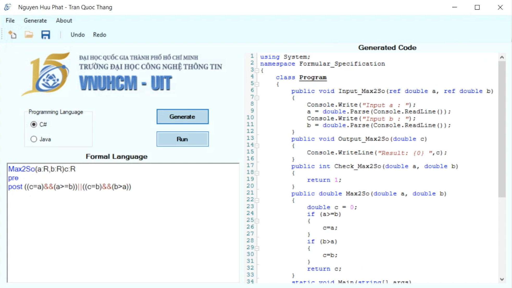
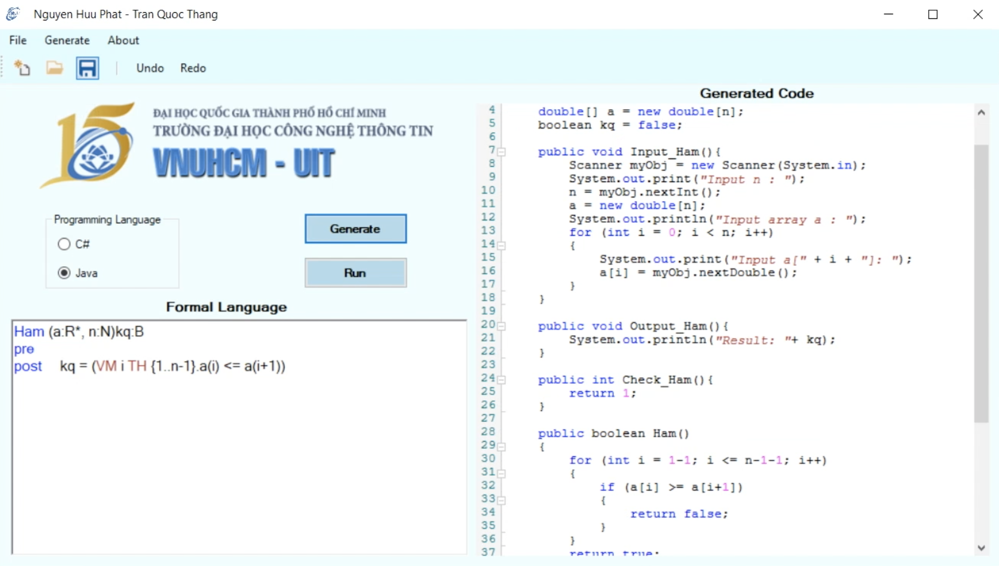
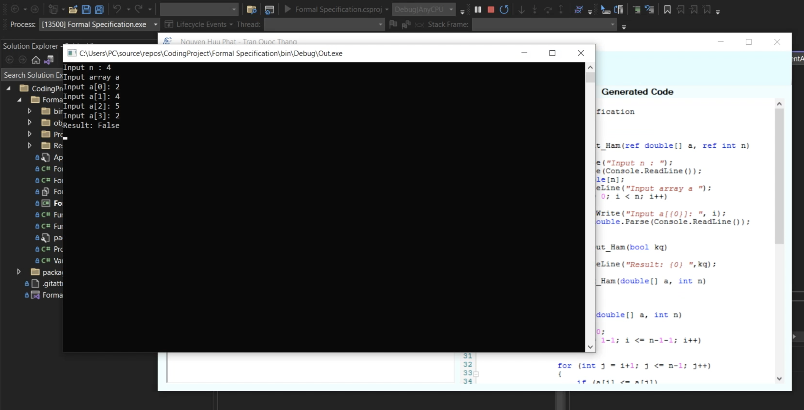
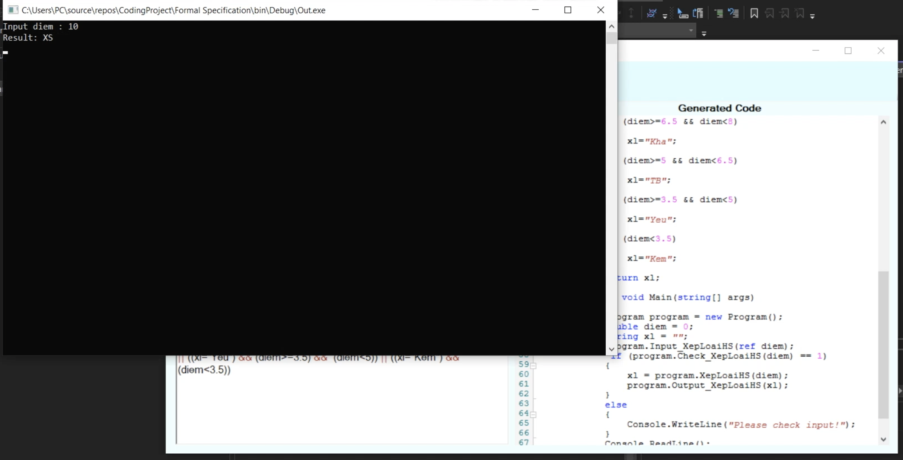

# Programming Specification Language Project

## Table of Contents
* [Introduction](#introduction)
* [Video Demo](#video-demo)
* [Technologies Used](#technologies-used)
* [Features](#features)
* [How to install and run the project](#how-to-install-and-run-the-project)
* [Acknowledgements](#acknowledgements)
* [Development Team](#development-team)
* [License](#license)

<!-- * [License](#license) -->

## Introduction
The aim of the project is to generate programming language from formal specifications.  
The input text is a formal specification function (implicit)  
Output is a completing program which uses one of above-mentioned programming languages can execute.  

In the project, it can convert formal specification to C# and Java.  
This is the [Software Requirements Document](https://docs.google.com/document/d/1QO5AZmznACN4H8sqZk6avHKcedXbSD4a/edit?usp=sharing&ouid=116992013396456829835&rtpof=true&sd=true) 

 

 
 

 

## Video Demo
You can have a look with Programming Specification Language Project through [the video](https://drive.google.com/file/d/1SrKTbYwm7p3g8LH7zbBoEFwuk4wfCXob/view?usp=sharing).

## Technologies Used
Programming Specification Language Project should use the following technologies, frameworks and development techniques:

- [Winform C# - .NET Desktop](https://docs.microsoft.com/vi-vn/dotnet/desktop/winforms/?view=netframeworkdesktop-4.8) 
- [Java](https://www.oracle.com/java/technologies/downloads/)

## Features
A few of the things you can do with Programming Specification Language Project: 
- Convert from Programming Specification Language to Programming language
- Open file
- Save file

## How to install and run the project
To clone and run this application, you'll need [.Net Framework](https://dotnet.microsoft.com/en-us/download/dotnet-framework), [Visual Studio](https://visualstudio.microsoft.com/) installed on your computer. 
`Run project` in Visual Studio

## Acknowledgements
- Thanks to [Microsoft](https://www.microsoft.com/vi-vn/) for supporting us with Asp.net documentation
- Thanks to [Stackoverflow](https://stackoverflow.com/) for supporting us 
- Thanks to [Github](https://github.com/) for supporting us control application's versions 

## Development Team
- [Nguyen Huu Phat](https://github.com/nguyenhuuphat2001)
- [Tran Quoc Thang](https://github.com/LucasTran-tq)

## 📝 License
Copyright © 2021.  

