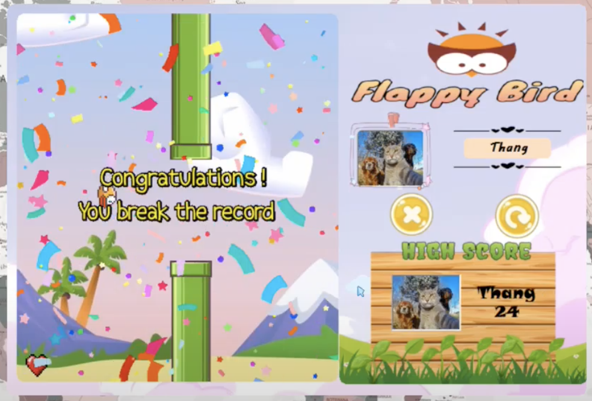

# Game Flappy bird premium 2021  

## Table of Contents
* [Introduction](#introduction)
* [Video Demo](#video-demo)
* [Technologies Used](#technologies-used)
* [Features](#features)
* [How to install and run the project](#how-to-install-and-run-the-project)
* [Acknowledgements](#acknowledgements)
* [Development Team](#development-team)
* [License](#license)

<!-- * [License](#license) -->

## Introduction
Our team hopes that with the opportunity to work together, we hope to not only revive a **Flappy Bird** that was once a success symbol in the field of game development in Vietnam, but also helped it reach further in the international game market - as a tribute to the creator of **Flappy Bird**.  

This is the [Software Requirements Document](https://docs.google.com/document/d/1a_hk918X5JFk6YQ7kUjswjCje2ZXxxBJ/edit?usp=sharing&ouid=116992013396456829835&rtpof=true&sd=true)

## Video Demo
You can have a look with Game Flappy bird premium 2021 through [the video](https://drive.google.com/file/d/1vISZxPL9c4Zdg4gkfZqXX6Wkw_NKYQTj/view?usp=sharing).

## Technologies Used
Game Flappy bird should use the following technologies, frameworks and development techniques:

- [Winform C# - .NET Desktop](https://docs.microsoft.com/vi-vn/dotnet/desktop/winforms/?view=netframeworkdesktop-4.8) 
- [GunaUI - UI library for Winform](https://gunaui.com/) 

## Features
A few of the things you can do with Game Flappy bird:
- Make high score
- Change session
- Change character
- Manage level of difficult
- Get coin
- Get point
- Get items

  

## How to install and run the project
To clone and run this application, you'll need [.Net Framework](https://dotnet.microsoft.com/en-us/download/dotnet-framework), [Visual Studio](https://visualstudio.microsoft.com/) installed on your computer. 
`Run project` in Visual Studio

## Acknowledgements
- Thanks to [Microsoft](https://www.microsoft.com/vi-vn/) for supporting us with Asp.net documentation
- Thanks to [Stackoverflow](https://stackoverflow.com/) for supporting us 
- Thanks to [Github](https://github.com/) for supporting us control application's versions 

## Development Team
- [Tran Quoc Thang](https://github.com/LucasTran-tq)
- [Vu Pham My Phuong](https://github.com/vnmp11)
- [Pham Ngoc Quyen](https://github.com/QuyenPham233)
- [Vo Trung Tin](https://github.com/Votrungtin2001)

## 📝 License
Copyright © 2021.  

